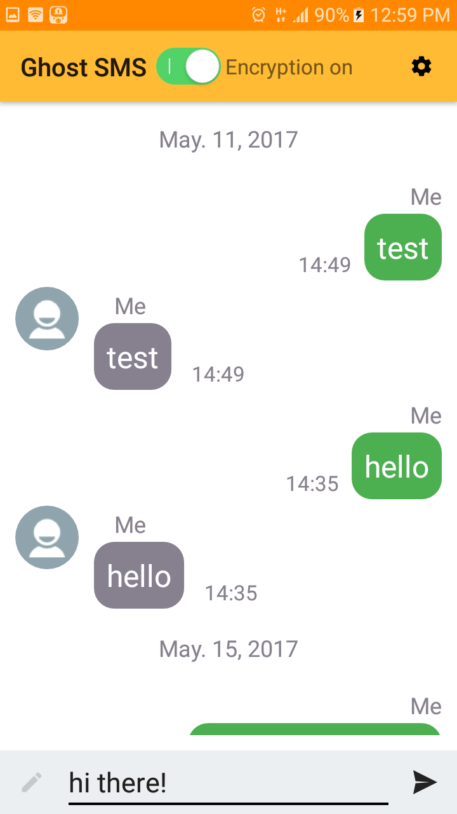

# Ghost SMS
Your SMS messages can now be fully secure and safe! Modern encryption algorithms prevent unauthorized 
third party from reading your messages even after their interception. Encrypted SMS guarantees your privacy.

**Ghost SMS** may be used for sending/receiving encrypted messages. This free messenger uses a combination 
of **RSA** and **AES** algorithms for encryption. 

Your private SMS will be encrypted on the sender side and it only can be read by the receiver by using his private encryption key. 
## Features
- **ONLY YOU CAN READ YOUR MESSAGES** Ghost SMS generates a unique public and private key pair so 
only you can read your conversation - not us, not your phone company, and not a 3rd party. We take a 
zero-access approach, and give you total control of your data.
- **BE AS PRIVATE AS YOU WANT TO BE** Whether you are a casual user or a privacy fanatic, you can adjust 
Ghost SMS's settings to fit your privacy needs. If a feature requires information sharing, you can choose 
to disable encryption.
- **WE DON'T STORE DATA ABOUT YOUR MESSAGES** We do not needlessly store information about you, your 
recipients or your messages. 
- **MULTIPLE LAYERS OF SECURITY** Ghost SMS encrypts your messages using a combination of symmetric keys, 
and public and private key pairs.

## LIMITATIONS:
* Encrypted text may be bigger than the original one.
* This application does not support MMS.
* The sender cannot retrieve the original message after sending it.
* If the receiver resets his application data on his phone, all received messages will be undecryptable.

## Snapshots

## Upcoming features
* give the user the possibility to regenerate his keys
* get other members public key / search for public keys
* the number of to-be-sent SMS must be displayed in the right bottom corner of a screen
* share public key

## Special Thanks

* [Parceler](http://parceler.org/) library contributors
* [butterknife](http://jakewharton.github.io/butterknife/) project contributors
* @pchmn for his [MaterialChipsInput](https://github.com/pchmn/MaterialChipsInput) library
* @bassaer for his [ChatMessageView](https://github.com/bassaer/ChatMessageView) library
* @wdullaer for his [SwipeActionAdapter](https://github.com/wdullaer/SwipeActionAdapter) library
* @aritraroy for his [PatternLockView](https://github.com/aritraroy/PatternLockView) library